# TF-4713 — Prefetch and cache the Drive access token

## Problem

Every Drive tap pays two sequential round-trips before the picker can render:

1. `POST /auth/token_exchange` — OIDC `id_token` → Drive access token
2. `POST /intents` — create the PICK intent (Bearer that token)

The exchanged token is discarded. The skeleton stays on screen for both.

## Locked decisions

- **Trigger = 4713.** Prefetch as soon as the Drive platform URI is available
  (session load), not at composer open, not at login as a separate hook.
- **Store = 4728 shape.** Abstract `WorkplaceTokenStore` with `obtain` /
  `recoverAfterUnauthorized` / `prime` / `clear`. One in-memory session.
- **No clock.** cozy-stack does not return `expires_in`. Cache until Drive
  rejects the token.
- **Refresh is reactive only.** It runs after a failed `POST /intents`, never
  on a timer and never during prefetch.
- **One store for the app**, on the keepAlive `WorkplaceComposerAttachmentExtension`.
  Composers do not own tokens.
- **No race-scheduling flags.** No generation counter, no `force`, no
  `_isRefreshing` boolean that other callers poll. Coordination is: return the
  cached session, or join the single in-flight `Future`.

## Flows

Preview this file: the diagrams below are the whole plan.

### 1. Who owns what

One keepAlive plugin, one store, many composers. `lib/` never names a token.

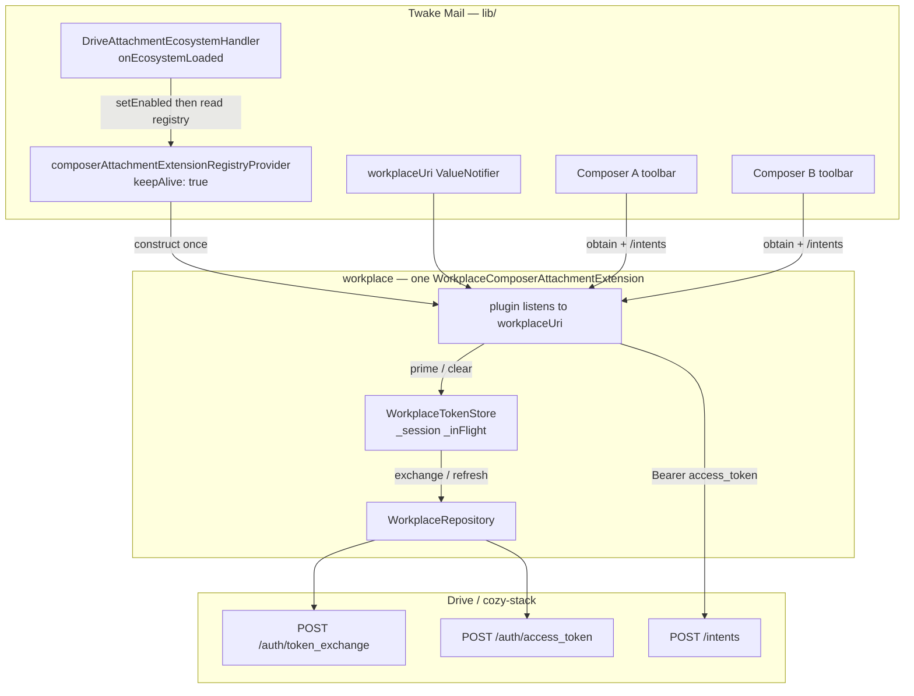

### 2. Whole happy path — session load then Drive tap

Prefetch is not on the tap. The tap should only create the intent.

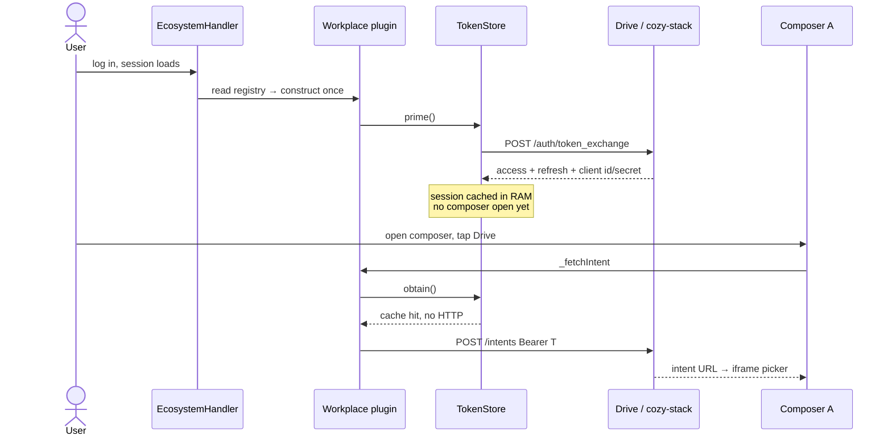

Today, for comparison: both round-trips sit inside the tap, and the token is
thrown away.

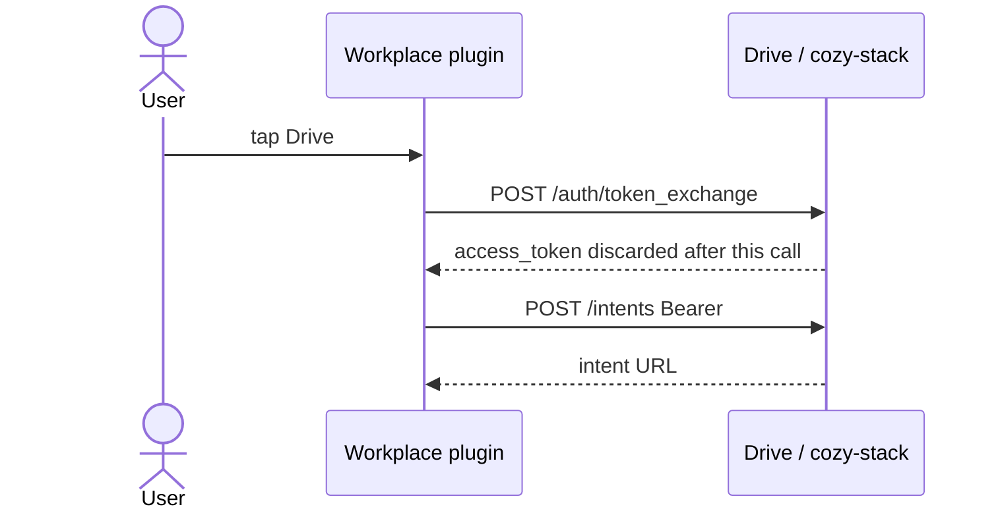

### 3. Token not ready at tap — `obtain()` only

The modal skeleton already covers the wait. No extra UX, no prefetch flag.

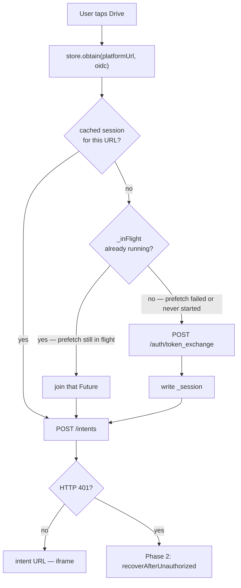

### 4. 401 — when refresh vs when re-exchange

Refresh never runs during prefetch or a warm `obtain`. It only runs after
`POST /intents` returns 401.

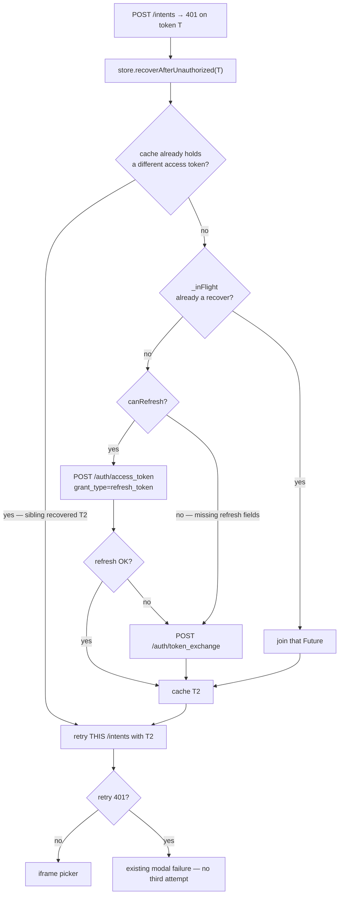

### 5. Multiple composers — share the token, never the intent

Each composer has its own Drive button and `_modalOpen` guard. Two taps on
**two** composers are two modals. The store only shares the session.

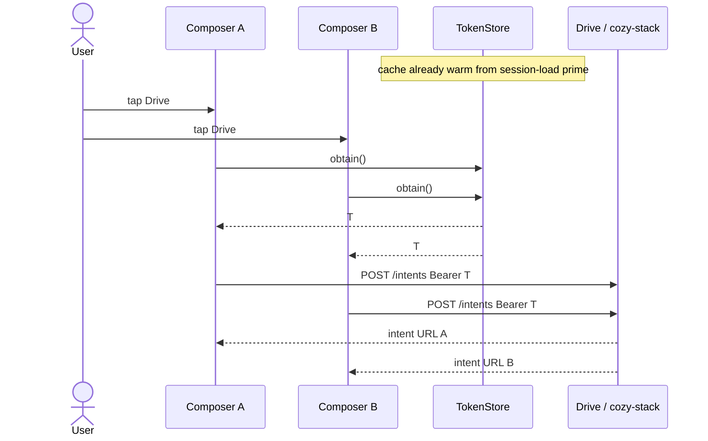

Cold cache or prefetch still in flight — one exchange, two intents:

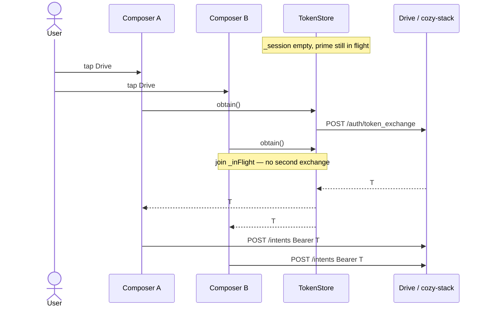

Both 401 on T — one recover, two retries:

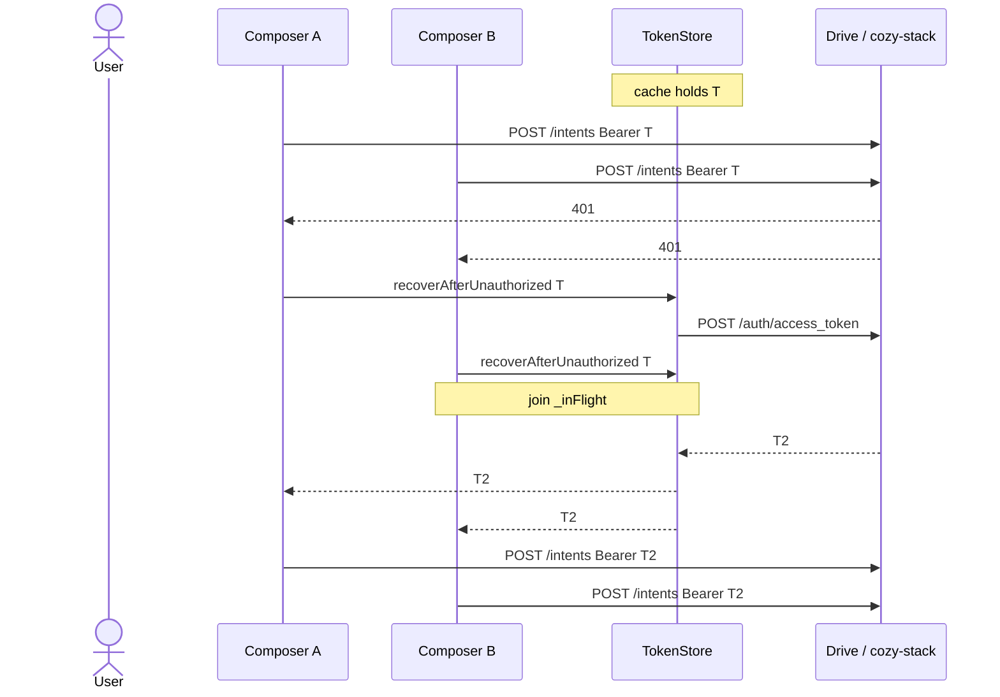

Composer A closes while B stays open — store does not move:

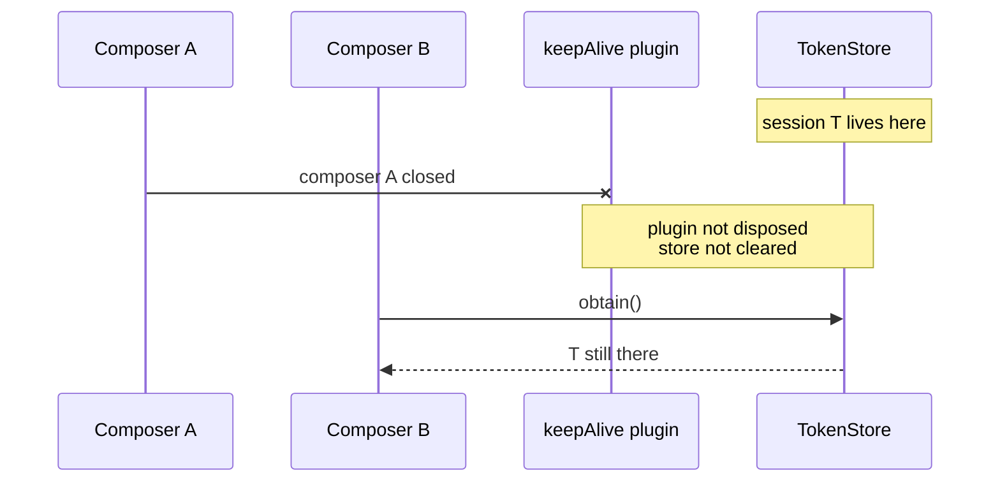

### 6. Same-button double tap vs two composers

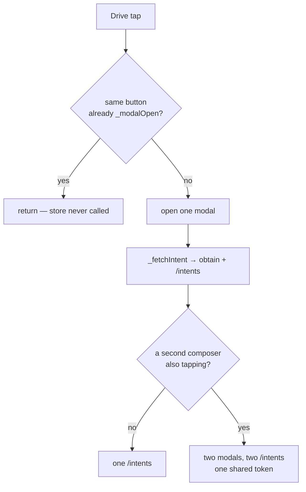

### 7. Invalidation — URI null, not composer close

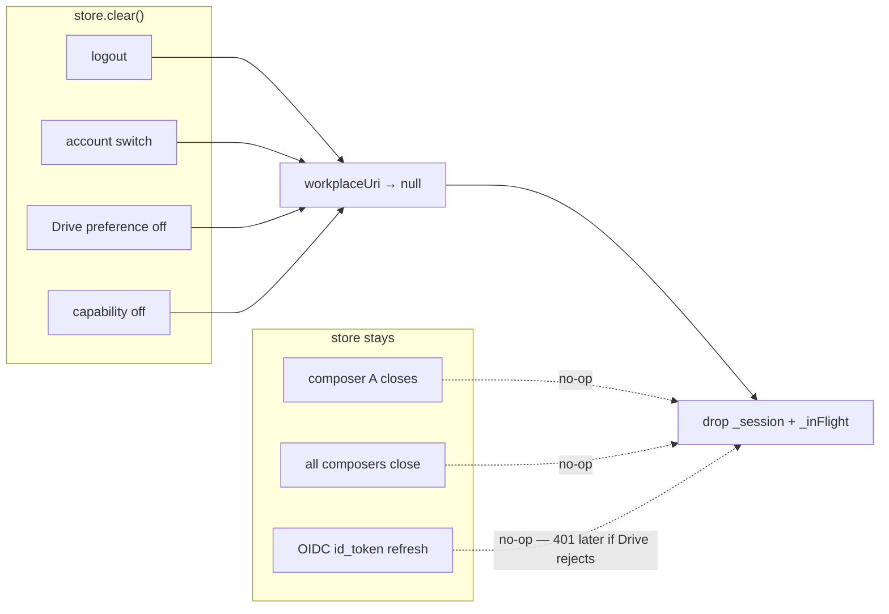

## Answers

### When / what handles refresh

| | |
|---|---|
| **When** | `POST /intents` comes back **HTTP 401** (Drive expired / invalid token). That is the only staleness signal. |
| **What** | `_fetchIntent` catches it and calls `store.recoverAfterUnauthorized(usedAccessToken)`. |
| **Inside recover** | If `canRefresh` (refresh token + client id + client secret all non-empty) → `POST /auth/access_token` with `grant_type=refresh_token`. Cache the new access token. Keep client id/secret. Keep the old refresh token if the response omits one. |
| **Then** | `_fetchIntent` retries **that composer's** `POST /intents` **once**. |

Prefetch (`prime`) and a warm tap (`obtain`) never refresh.

### When / what handles not-refresh (full re-exchange)

Same entry point as refresh: `recoverAfterUnauthorized` after a 401.

Re-exchange instead of refresh when:

- `canRefresh` is false (backend left refresh fields empty — still an open
  check: capture one real `token_exchange` response in Phase 1), or
- the refresh grant throws.

Then: `POST /auth/token_exchange` → cache the new session → retry `/intents`
once.

A second 401 after that retry is **not** recovered. It surfaces into the
existing modal failure. Timeouts, 500s, and 403s are not staleness — they
rethrow with no retry.

`obtain` / `prime` only ever exchange. They do not refresh.

### When / what handles reuse across multiple composers

Nothing is restored. There is no per-composer token and nothing is persisted.

Web can keep several composers (`ComposerManager.composers`). Every toolbar
calls `buildToolbarButton(composerId: …)` on the **same** keepAlive plugin.
The store is a field on that plugin.

| Event | What happens |
|---|---|
| Composer B opens while A is open | Registry `read` is a keepAlive hit. Constructor does not run. Store unchanged. Zero HTTP. |
| A and B both tap Drive, cache warm | Two `POST /intents`, zero `token_exchange`. Correct: each modal needs its own intent. |
| A and B both tap Drive, cache empty / prefetch still in flight | Both `obtain()` join the same in-flight Future. **One** `token_exchange`. Then two `/intents`. |
| A and B both get 401 on token T | Both call `recoverAfterUnauthorized(T)`. **One** refresh (or one exchange). Each retries **its own** `/intents`. |
| A already recovered to T2; B's 401 arrives later | B sees cache already holds a different access token than T → return T2, zero HTTP, retry `/intents`. |
| A closes, B stays | Do **not** clear or dispose. Store lives on the keepAlive plugin, not on A's controller. |
| All composers close | Store stays until the Drive URI goes null (logout / account switch / preference off) or the registry is disposed. |
| Process death | RAM is gone. Next session load exchanges again. |

### Token not ready when the user taps Drive

The button is only built when `workplaceUri` is non-null, so a tap always has
a platform URL.

`obtain()` is a cache lookup that **awaits work already in flight**:

1. Cached session → return it (no HTTP).
2. Prefetch still running → await that same Future (no second exchange).
3. Prefetch failed (errors are swallowed) or never started → start one
   `token_exchange` now.

The modal already shows a skeleton until `intentLoader` completes. No extra
UX, no polling, no "wait for prefetch" flag. Worst case equals today: the tap
pays for the exchange.

If `oidcTokenGetter()` was null at prefetch time, `prime` no-ops. The tap
path `obtain()` still exchanges once the OIDC token exists, or throws the
existing "OIDC unavailable" error if it does not.

### Multiple clicks on the Drive button

**Same composer — do not handle in the store.**
`DrivePickerStateMixin` already has `_modalOpen`. A second tap on the same
button returns immediately. One button → at most one modal → at most one
`_fetchIntent`. Adding click-coalescing in the store would duplicate that
guard and couple token lifecycle to UI.

**Two composers — allowed.**
Two buttons, two `_modalOpen` flags, two modals, two `/intents`. The store
only shares the **token**, never the intent. That is the real multi-composer
case above, not a double-click.

## Races we handle vs races we ignore

### Handle (they happen in the product)

1. **Prefetch in flight, user taps.** `obtain()` joins `_inFlight`.
2. **Two composers tap with a cold cache.** Same join. One exchange, two intents.
3. **Two composers 401 on the same access token.** Join one recover. Each
   retries its own `/intents`. If one recover already finished, the other
   reads the newer cached access token.
4. **URI goes null then non-null while a request is in flight** (logout,
   account switch, preference toggle). `clear()` drops the cache. A late
   HTTP completion must not write over a newer session: only cache the result
   if that Future is still the current `_inFlight` (`identical`, not a
   generation counter). This is ownership of the slot, not a scheduler flag.

### Do not build (unreal or already owned elsewhere)

- Generation counters, `force` flags, `_isRefreshing` booleans.
- Pairing two composers' `/intents` retries with a shared retry coordinator.
- Double-click on one button (mixin guard).
- N composers opening in the same tick as a special protocol (keepAlive
  construct-once already makes this one prefetch).
- Seeding the cache on OIDC `id_token`. An OIDC refresh must not drop a live
  Drive token. URI-null is the invalidation signal; 401 is the staleness signal.
- Prefetching the intent (`force_session_id=true`, tap-time payload).
- TTL / `expiresAt` / JWT `exp`.
- Dio interceptor.
- Disk persistence.

## Architecture notes

`lib/` names no token type, no store, no refresh. It already supplies
`workplaceUri` and `oidcTokenGetter`, and it already builds the registry.
Phase 1 adds one `read(registryProvider)` in the ecosystem handler (a file
that already has `appProviderContainer` call sites) plus registry `dispose`.

See [Flows](#flows) for the ownership and sequence diagrams.

## Store port

```dart
abstract class WorkplaceTokenStore {
  Future<WorkplaceTokenSession> obtain({
    required Uri platformUrl,
    required String oidcIdToken,
  });

  Future<WorkplaceTokenSession> recoverAfterUnauthorized({
    required String usedAccessToken,
    required Uri platformUrl,
    required String oidcIdToken,
  });

  Future<void> prime({Uri? platformUrl, String? oidcIdToken});

  void clear();
}
```

| Method | Contract |
|---|---|
| `obtain` | Return a session for this `platformUrl`. Cache hit if URL matches. Else join `_inFlight` or start one `token_exchange`. |
| `recoverAfterUnauthorized` | Must **not** call `obtain()` (that would return the dead token). If cache already holds a **different** access token, return it. Else join `_inFlight` or start one refresh, falling back to one exchange. |
| `prime` | Fire-and-forget `obtain`. No-op if uri or oidc is null. Swallow errors. |
| `clear` | Drop `_session` and `_inFlight`. |

Impl: `InMemoryWorkplaceTokenStore`. Private fields: `_session`, `_platformUrl`,
`_inFlight`. HTTP injected as `exchange` / `refresh` callbacks from the
repository. `canRefresh` lives on `WorkplaceTokenSession`.

`recoverAfterUnauthorized` compared to `usedAccessToken` is cache coherence,
not a race flag: "the token that failed is no longer the cached one, so a
sibling already recovered."

## Phases

| # | Phase | Status |
|---|-------|--------|
| 1 | [Prefetch, store, obtain](phase-01-prefetch-drive-access-token.md) | Not started |
| 2 | [Recover on 401](phase-02-refresh-drive-access-token.md) | Not started |
| 3 | Record ADR 0106 from the merged code | Not started |

Phase 1 is usable alone (faster first tap, new failure mode if the cached
token goes stale). Do not ship it far ahead of Phase 2.

## Success criteria

- Session load with Drive enabled issues **one** `token_exchange` with no
  composer open.
- Drive tap with a warm store issues **only** `POST /intents`.
- Two composers, warm store: two `/intents`, zero exchanges.
- Two composers, cold store: **one** exchange, two `/intents`.
- Tap while prefetch is in flight: **zero** extra exchanges.
- Same-button double tap: second tap ignored by `_modalOpen`; store unchanged.
- 401 on `/intents`: one recover (refresh if possible, else exchange) + one
  retry `/intents`.
- Two composers 401 on T: **one** recover HTTP; two `/intents` retries.
- Composer A close does not drop the session used by B.
- URI → null clears the cache. URI back to non-null primes once.
- No TTL / `expiresAt`. No token types under `lib/`.
- `fvm flutter test` green in `workplace/` and touched `lib/` tests.

## Out of scope

- Dio interceptor / stripping `accessToken` from `createIntent`.
- AppToken `GET /?refreshToken` (cookie session). We are an OAuth client.
- Persist across process death.
- Intent prefetch.
- ComposerController.onInit prime (rejected in favour of session-load trigger).
- `RefreshDriveTokenInteractor` + extra states (store calls the repository).

## Open question

`/auth/token_exchange` models `refresh_token`, `client_id`, `client_secret`,
but nothing has ever read them. Capture one real response in Phase 1. If they
are null, Phase 2 recover degrades to re-exchange (still correct).
